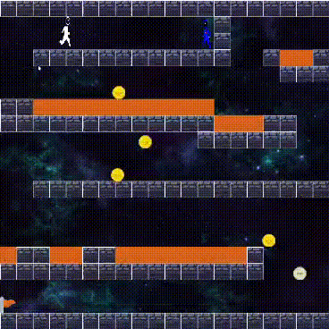

# Spacewalker-Zero-G-Odyssey

Este é um simples jogo simples que brinca com a gravidade criado no Laboratório de Programação de Jogos na Universidade Federal Fluminense (UFF).

## Instalação

Antes de começar a jogar, instale o Pygame. Você pode fazer isso facilmente usando o pip:

```bash
pip install pygame
```
<p align="center">
  
</p>

